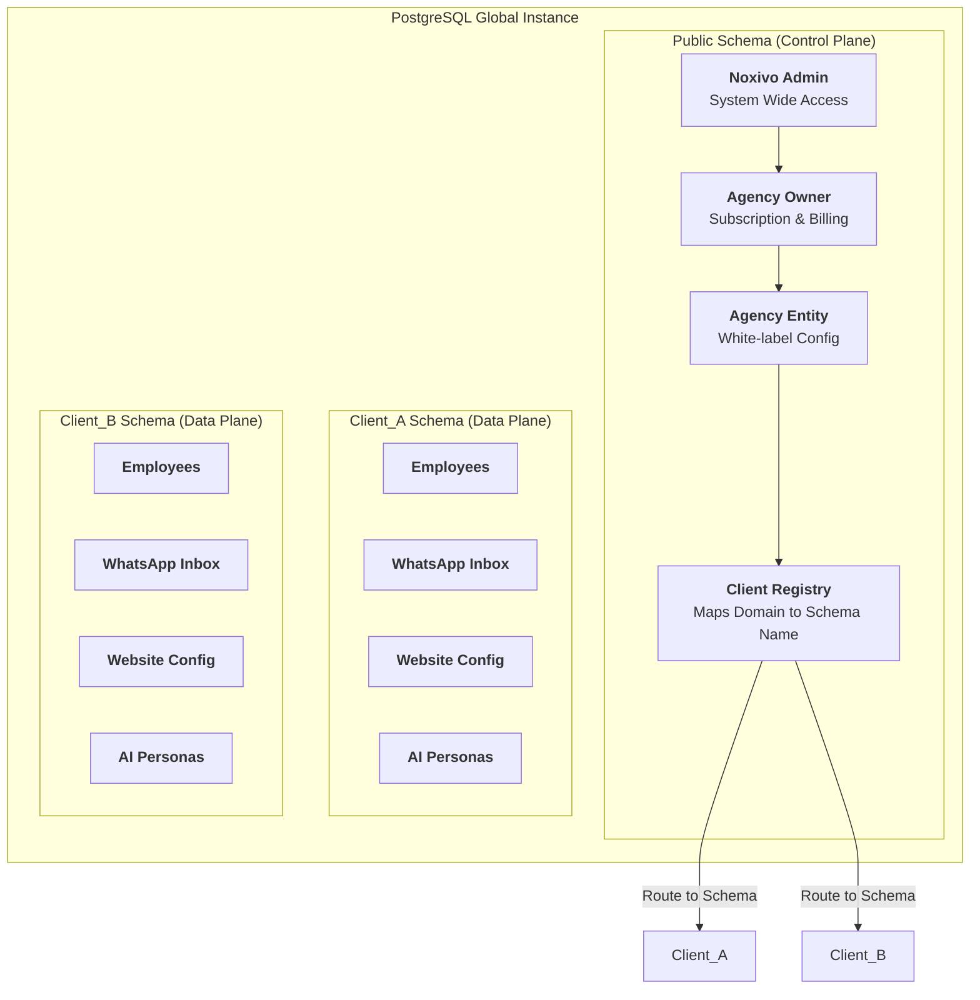
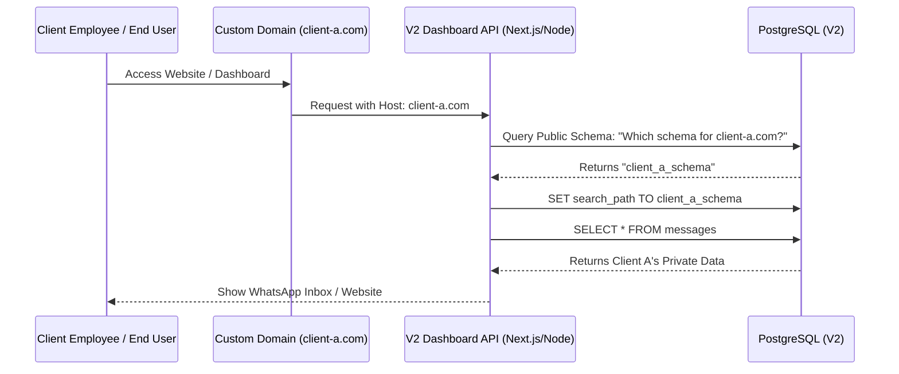
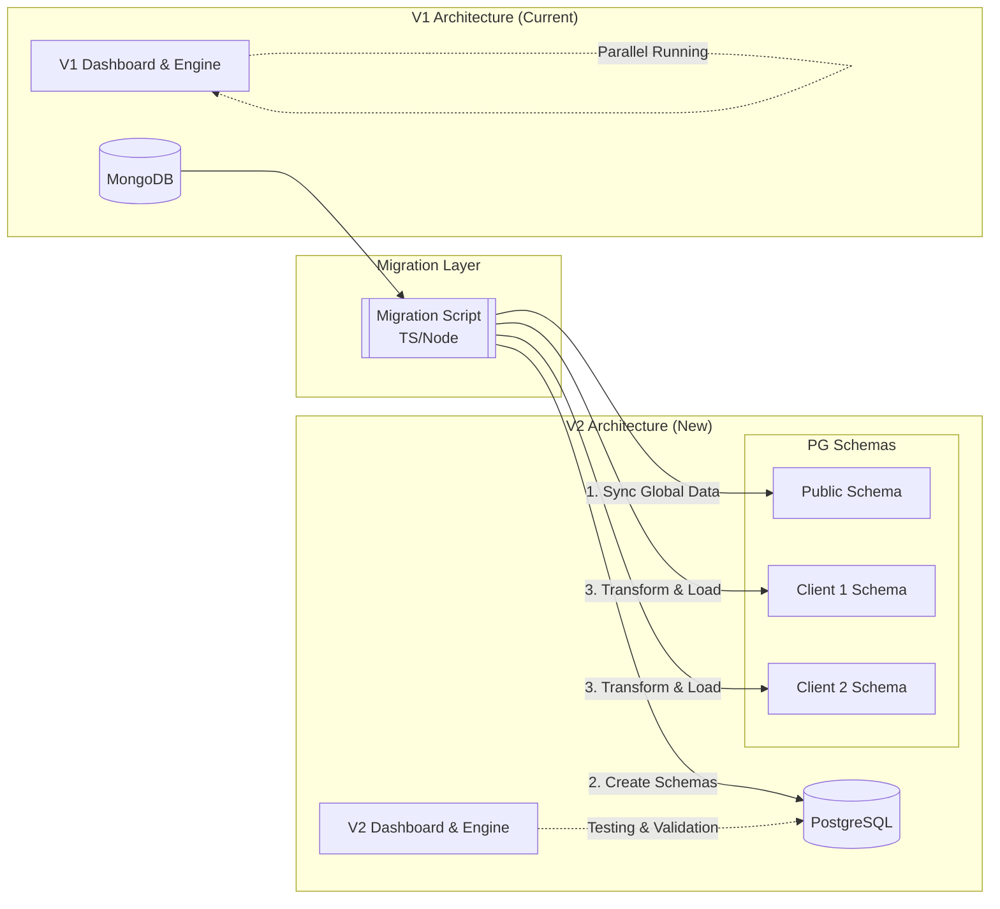

# Noxivo V2: PostgreSQL Schema-per-Client Architecture

This document outlines the architectural transition from MongoDB (V1) to PostgreSQL (V2) with a "Sub-DB" (Schema-per-Client) approach.

> **Tip:** In VS Code, press `Cmd+Shift+V` (Mac) or `Ctrl+Shift+V` (Windows/Linux) to open the Markdown preview and render these diagrams.

## 1. Entity & Multi-Tenancy Hierarchy
This shows how data is physically isolated using PostgreSQL Schemas.

---

## 2. Multi-Tenant Routing Logic
How a request from a custom domain dynamically finds its private "Sub-DB".

---

## 3. Migration Strategy (V1 to V2)
How we safely migrate data from MongoDB to the new PostgreSQL structure.

