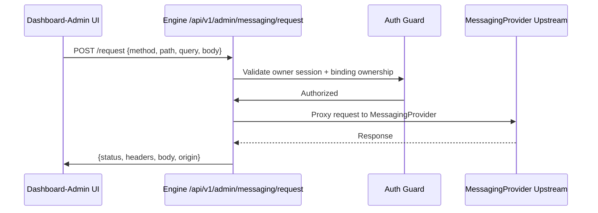
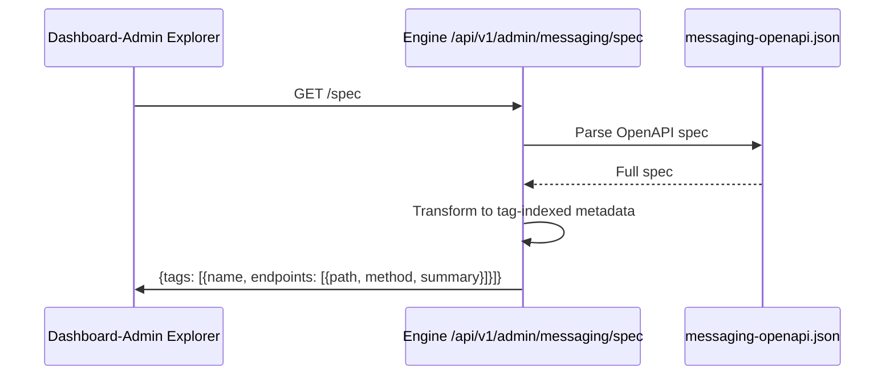

# MessagingProvider Backend Completion & Dashboard-Admin API Explorer Design

**Date:** 2026-04-16
**Status:** Draft - Pending Approval
**Related:** `messaging-openapi.json`, `TODO.md`, `SESSION_HANDOFF.md`

---

## 1. Overview

Make MessagingProvider coverage **functionally complete** through `workflow-engine` and enable `dashboard-admin` to operate/test all MessagingProvider categories via a **MessagingProvider API Explorer** interface.

**Chosen Scope:** API Explorer + Core Pages in `dashboard-admin` (not full bespoke page per category).

**Done Rule:** No engine-side missing-handler failures (`404/500` from backend logic); MessagingProvider limitations surfaced clearly as upstream responses.

---

## 2. Architecture

### 2.1 Backend Changes

#### 2.1.1 MessagingProvider Parity Test Harness
- Reads `messaging-openapi.json` and verifies each public MessagingProvider path is reachable via engine path mapping (`/api/...` -> `/api/v1/...`) or explicit compatibility wrapper.
- Generates coverage report by MessagingProvider tag/category.

#### 2.1.2 Fallback & Compatibility Wrappers
- Keep `/api/v1/*` fallback as universal MessagingProvider passthrough.
- Add legacy/compat wrappers only where needed for dashboard UX:
  - `sessions/:id/...` shortcuts
  - Admin session actions
  - Status/stories endpoints
  - `messages/send` fallback

#### 2.1.3 Error Normalization
- Standardize proxy errors into structured envelope:
  ```typescript
  interface ProxyEnvelope {
    origin: 'engine' | 'messaging_upstream';
    status: number;
    headers: Record<string, string>;
    body: unknown;
  }
  ```
- Preserve upstream status/body.
- Eliminate unhandled engine 500s in chat/message/status flows.

#### 2.1.4 Webhook Completion
- Tolerant resolution for missing binding.
- All listed webhook event types return deterministic non-crashing outcomes.
- Logged with per-event verdict (`processed`, `ignored`, `unprocessable`).
- Persist quoted context/media (`replyTo.media`).

#### 2.1.5 New Admin Endpoints
| Endpoint | Method | Description |
|----------|--------|-------------|
| `/api/v1/admin/me` | GET | Returns authenticated admin identity/session info for dashboard bootstrapping |
| `/api/v1/admin/logout` | POST | Clears admin session cookie |
| `/api/v1/admin/messaging/spec` | GET | Returns sanitized MessagingProvider endpoint/tag metadata for dashboard explorer |
| `/api/v1/admin/messaging/request` | POST | Executes validated owner-authenticated MessagingProvider calls from explorer UI |

---

### 2.2 Dashboard-Admin Changes

#### 2.2.1 New Pages

**MessagingProvider Explorer** (`/explorer`)
- Tag-based sidebar navigation matching MessagingProvider spec categories:
  - 📱 Pairing
  - 🔑 Api Keys
  - 👤 Profile
  - 💬 Chatting
  - 👁️ Presence
  - 📢 Channels
  - 📊 Status
  - 💭 Chats
  - 🔐 Contacts
  - 👥 Groups
  - 📞 Calls
  - 📅 Events
  - 🏷️ Labels
  - 🖼️ Media
  - 📦 Apps
  - 📈 Observability
  - 💾 Storage
  - 🔗 Webhooks
  - 📱 Sessions

- Each category shows list of endpoints with:
  - Method badge (GET/POST/PUT/DELETE)
  - Path
  - Summary description
- Click endpoint to expand request builder:
  - Path parameters editor
  - Query parameters editor
  - Request body editor (JSON)
  - Send button
- Response panel:
  - Status code
  - Response headers (safe subset)
  - Response body (pretty-printed)
  - Origin indicator (`engine` or `messaging_upstream`)

**Webhook Tools** (`/webhooks`)
- List of webhook event types received
- Event log with timestamps
- Per-event details (payload, verdict)
- Test webhook injection

#### 2.2.2 Navigation
Add to Sidebar:
```tsx
<NavItem to="/explorer" icon={<Api size={18} />} label="MessagingProvider Explorer" />
<NavItem to="/webhooks" icon={<Webhook size={18} />} label="Webhook Tools" />
```

#### 2.2.3 Auth Integration
- Use existing `admin.login` from `admin.routes.ts` for authentication.
- Bootstrap admin identity from `/api/v1/admin/me` on app load.
- Logout clears cookie via `/api/v1/admin/logout`.

---

## 3. Data Flow

### 3.1 Explorer Request Flow


### 3.2 MessagingProvider Spec Endpoint Flow


---

## 4. Implementation Steps

### Phase 1: Backend API (Priority)
1. **Add admin `/me` endpoint** - Return current authenticated admin identity
2. **Add admin `/logout` endpoint** - Clear session cookie
3. **Add `/admin/messaging/spec` endpoint** - Parse `messaging-openapi.json` and return sanitized tag-indexed metadata
4. **Add `/admin/messaging/request` endpoint** - Execute validated MessagingProvider calls with owner auth + allowlist
5. **Update error handling** - Standardize proxy responses with origin envelope
6. **Create parity test harness** - Verify all MessagingProvider paths are mapped

### Phase 2: Dashboard-Admin UI (Priority)
1. **Add Explorer page** - Full-featured API explorer with tag sidebar
2. **Add Webhook Tools page** - Event log and test interface
3. **Add navigation items** - Sidebar links to new pages
4. **Integrate auth** - Bootstrap from `/me`, logout via `/logout`

### Phase 3: Testing
1. **Parity tests** - OpenAPI coverage verification
2. **Category smoke tests** - Test all 19 categories
3. **Regression tests** - messages/send, status, webhooks
4. **E2E tests** - Explorer request execution flow

---

## 5. Acceptance Criteria

| Criterion | Verification |
|-----------|--------------|
| `/api/v1/admin/me` returns admin identity | `curl` test |
| `/api/v1/admin/logout` clears cookie | Browser test |
| `/api/v1/admin/messaging/spec` returns all 19 tags | Parse response |
| `/api/v1/admin/messaging/request` executes valid MessagingProvider calls | Explorer UI test |
| No engine 500 on any mapped MessagingProvider path | Parity test |
| Dashboard-Admin has Explorer page | Navigate to `/explorer` |
| Dashboard-Admin has Webhook Tools page | Navigate to `/webhooks` |
| All tests pass | `pnpm test` |

---

## 6. Assumptions

- Use existing MessagingProvider deployment (`WEBJS`) compatible with `2026.4.1`.
- `dashboard-admin` remains owner-only mission-control.
- "Fully implemented" = backend path coverage + deterministic handling + production-tested.
- Auth flow follows MessagingProvider Plus documentation (session-based).

---

## 7. Trade-offs

| Decision | Trade-off |
|----------|------------|
| Full Explorer UI vs Simple | More development time, but enables full MessagingProvider operability |
| Full 19-category coverage vs Core | More test harness work, but complete parity guarantee |
| Automated tests vs Manual | More upfront work, but regression safety |
| Tag-based navigation vs Flat | Better organization, slightly more complex UI code |

**Recommendation:** Proceed with full implementation as specified - the scope is well-defined and testable.